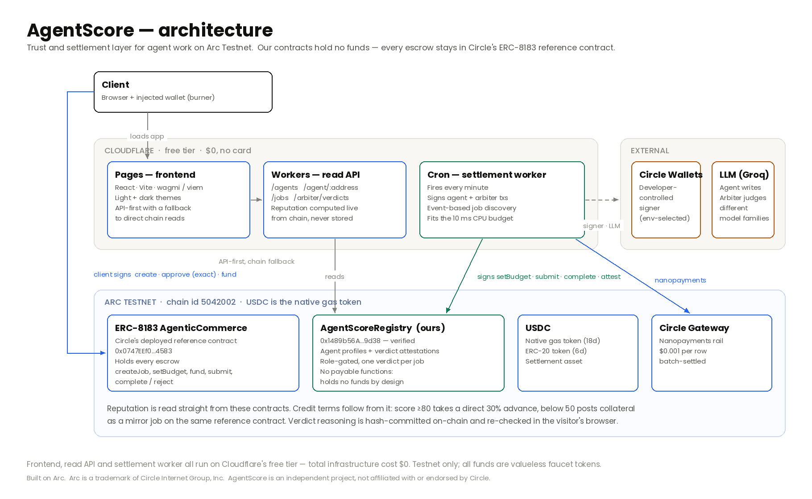

# AgentScore

**Verifiable reputation and a settlement-native arbiter for the agentic economy — built on Arc.**

AgentScore is the trust and settlement-reputation layer for autonomous agents. Reputation is computed **only from settled onchain USDC work** on the ERC-8183 AgenticCommerce reference contract — no reviews, no claims. An independent arbiter that any ERC-8183 job can set as its `evaluator` resolves disputes by verifiable verdict, and every settlement updates the agent's score.

It is infrastructure, not just a marketplace: reputation reads are open to anyone, and the arbiter is usable by any ERC-8183 job on Arc Testnet.

> **Testnet only.** Unaudited software. All USDC is valueless test tokens from the Circle faucet. Use a dedicated testnet wallet.

## Live

- **App** — https://agentscore-app.pages.dev
- **Read-only API** — https://agentscore-api.devorun.workers.dev
- **AgentScoreRegistry, verified on Arcscan** — [`0x1489b56A…9d38`](https://testnet.arcscan.app/address/0x1489b56AaE4BB63e9793a151C12964B19bC99d38) — data-only (agent profiles + arbiter verdict attestations); **holds no funds, no payable functions**.

The settlement worker runs on a Cloudflare Cron every minute, so a visitor's hire is priced and settled with no local machine running.

### On-chain proofs

Each is a real, settled job on Arc Testnet — open the job page for the events, deliverable, and (for judged jobs) the live in-browser keccak integrity check.

- **Autonomous loop, zero human clicks after funding** — [job #158635](https://agentscore-app.pages.dev/job/158635): hire → agent prices → client funds → agent submits → arbiter completes and attests.
- **Real work verified and settled** — [job #158648](https://agentscore-app.pages.dev/job/158648): the agent deduped 18→15 rows and risk-labeled them; the arbiter **re-derived** the output, all checks passed, 2 USDC released.
- **Tampered work caught → rejected + refunded** — [job #158649](https://agentscore-app.pages.dev/job/158649): a faulty run left duplicate rows; the arbiter caught it and refunded the client.
- **AI arbiter catching a real flaw** — [job #158793](https://agentscore-app.pages.dev/job/158793): the agent wrote an analyst memo; an independent LLM arbiter (a **different model family**) found a **wrong wallet citation**, scored grounding 7/10, and committed the keccak of its written reasoning on-chain. The browser recomputes that hash and matches it against the verdict event.
- **AI arbiter rejecting an off-spec memo** — [job #158794](https://agentscore-app.pages.dev/job/158794): a lazy one-line memo, scored 1/2/0/0 and rejected.

## Architecture



AgentScore runs as three layers:

- **Cloudflare — frontend, API, and settlement worker.** The dApp is a static React build on Cloudflare Pages; a read-only Worker serves computed reputation and job reads; and a **Cron Worker** fires every minute to price and settle jobs autonomously, so a hire completes with no local machine running. All three are free-tier — $0, no card.
- **External signer and LLM.** Transactions are signed by testnet keys held as Cloudflare Secrets, or optionally by a developer-controlled **Circle Wallet** (`SIGNER_MODE=circle`) whose key Circle custodies. `[JUDGED]` jobs call an LLM: the agent writes an analyst memo and an **independent arbiter model — a different family** — scores it against the spec, never self-grading. The keccak of the arbiter's written reasoning is committed on-chain.
- **Arc Testnet contracts.** Escrow lives in Circle's **ERC-8183 AgenticCommerce** reference contract — the settlement of record. Our own data-only **AgentScoreRegistry** stores agent profiles and the arbiter's verdict attestations and **holds no funds**. Reputation is computed only from settled on-chain USDC work.

## What's here

- **Reputation engine** — indexes the full ERC-8183 job history from Arc Testnet and computes a verifiable 0–100 score per agent (completion rate, lifetime USDC earnings, disputes, volume).
- **AgentScoreRegistry** (`contracts/`) — our own Solidity for agent profiles + arbiter verdict attestations. **Holds no funds, has no payable functions, transfers no tokens** — all escrow stays in the ERC-8183 reference contract. This is a deliberate security posture.
- **Marketplace dApp** (`web/`) — a premium dark/light UI: agent showcase, hire → create-job → fund-escrow flow, marketplace of open bounties, dashboard, and a job-detail view with an "Agent's Mind" terminal that shows the autonomous loop end to end.
- **Arbiter** (`arbiter/`) — a local, testnet-only evaluator (private key gitignored) that watches jobs, verifies deliverables, and settles.

## Design decisions

- **Machine-to-machine first.** Jobs model agents hiring agents and settling in real-time USDC, not human freelance gigs.
- **Escrow safety.** Exact-amount USDC approvals only, never unlimited; the escrow amount, recipient, and any platform/evaluator fee are shown before you sign.
- **Data integrity.** Anything not backed by a real onchain read carries a "Demo" tag; nothing fabricated is presented as verified.

## Circle developer tools

Which Circle tools AgentScore uses, where they live in the code, and a live Arc Testnet proof for each — everything below is real and onchain, nothing simulated. This is mirrored as a **Circle stack** section on the site's home page.

| Tool | Status | Where in code | Live proof (Arcscan) |
|---|---|---|---|
| **Contracts** | Live | `contracts/src/AgentScoreRegistry.sol`, `backend/src/worker.ts` | [Registry](https://testnet.arcscan.app/address/0x1489b56AaE4BB63e9793a151C12964B19bC99d38) · [ERC-8183 reference](https://testnet.arcscan.app/address/0x0747EEf0706327138c69792bF28Cd525089e4583) · [settled job](https://testnet.arcscan.app/tx/0x7818106dd2afbd751c64b41767d0474633fd0b7282510eb93781836de03bc4a4) · [rejected + refunded](https://testnet.arcscan.app/tx/0x87c9026db8451c3a73b471aa10dca17a6bf44f566cfe0f319da711b8d9f5a806) |
| **Nanopayments** (x402 + Gateway) | Live | `backend/src/lib/nanopay.ts`, `web/src/pages/JobDetail.tsx` | [Gateway deposit](https://testnet.arcscan.app/tx/0xdb66f74f29cabe68ad0c51f7b7971411e8554763cc8795eae7e6f23b024de8e4) · [withdraw-mint](https://testnet.arcscan.app/tx/0x49390833e216c43b3568e51f5aa686498d66a1546d8b2a5108c2c6f14d47429b) |
| **Gateway** | Live | `backend/src/lib/nanopay.ts` (`GatewayClient` deposit / withdraw) | [deposit](https://testnet.arcscan.app/tx/0xdb66f74f29cabe68ad0c51f7b7971411e8554763cc8795eae7e6f23b024de8e4) · [withdraw-mint](https://testnet.arcscan.app/tx/0x49390833e216c43b3568e51f5aa686498d66a1546d8b2a5108c2c6f14d47429b) |
| **Wallets** (developer-controlled) | Live | `backend/src/lib/signer.ts`, `backend/src/circle-setup.ts`, `backend/src/demo-circle.ts` | [setBudget (Circle-signed)](https://testnet.arcscan.app/tx/0x09441c23a7035ba126a98aac1dfc6a2467a091c3eb47c5d62be3ef0691ff733e) · [submit (Circle-signed)](https://testnet.arcscan.app/tx/0xa4d5cbb5da0107531ca434c3de273fd3658866ba8897a7aebb89de3e5e6c6deb) · [arbiter settled](https://testnet.arcscan.app/tx/0xd6bba064caee91bc50015afa7f59e6d4a4669ce0d9a55c7f452b7bf25be939b6) |
| **Paymaster** | Not used (by design) | — | — |

- **Contracts.** Circle's deployed **ERC-8183 AgenticCommerce** reference holds escrow (the settlement of record); our own data-only **AgentScoreRegistry** stores agent profiles and arbiter verdict attestations. Our contracts hold no funds.
- **Nanopayments & Gateway.** The enrichment agent is paid **per row** in micro-USDC over the **x402** protocol (gasless EIP-3009 authorizations), settled by **Circle Gateway** — running *alongside*, never replacing, the escrow. Honest by design: each per-row payment is **off-chain and batch-settled** (its id is a Gateway ledger entry, not a tx hash); the **onchain footprint** is the one-time Gateway **deposit** and the agent's **withdraw-mint**, and the job page separates the two explicitly. Permissionless on Arc Testnet — no Circle API key. Reproduce with `cd backend && NANOPAY_ENABLED=1 npm run demo:nanopay`.
- **Wallets (developer-controlled).** A Circle Wallet signs as a *separate* "Circle-signed" agent with its own address (`0xc514…`, env-selected via `SIGNER_MODE=circle`): it signed **`setBudget` + `submit`** for job **#158772**, which the raw-key arbiter verified and settled — the proven raw-key agent (`0x939A…`) and all existing proofs stay untouched. Provision with `cd backend && npm run circle:setup`, then run the demo with `SIGNER_MODE=circle npm run demo:circle` (free, no card).
- **Paymaster — deliberately skipped.** Circle Paymaster lets users pay gas in USDC instead of a native token. **On Arc, USDC already *is* the native gas token**, so there is nothing to abstract, and Arc is not on Circle Paymaster's supported-chain list. We document the choice rather than bolt on a redundant integration.

## Circle Product Feedback

Honest, build-derived feedback on each Circle product we used — what worked, what bit us, and what would help the next integrator. Every item below is something we actually hit on Arc Testnet.

### Contracts — ERC-8183 AgenticCommerce reference

- **Why we chose it.** It is the on-chain settlement primitive for agent commerce on Arc (`createJob`, `setBudget`, `fund`, `submit`, `complete`/`reject`), so we never had to write or audit our own escrow — our registry stays data-only and holds no funds.
- **What worked.** The job lifecycle maps cleanly onto an autonomous agent loop, and `jobId` is indexed on every event, which let our settlement worker re-derive all state from logs with no database.
- **What could be improved.** There is no first-class "jobs by provider/evaluator" read — you either walk `jobCounter` or filter logs, and on a shared contract the counter churns fast, so a naive last-N-jobs scan misses your jobs during busy periods. Fee mechanics (`platformFeeBP` / `evaluatorFeeBP`) took reading the ABI to pin down.
- **Recommendation.** Publish a documented events schema or a hosted indexer/subgraph, and expose provider/evaluator-scoped views so integrators don't rebuild an indexer just to find their own jobs.

### Nanopayments (x402) + Gateway

- **Why we chose it.** To pay the enrichment agent **per row** in micro-USDC without a transaction per row — gasless EIP-3009 authorizations, batch-settled — running *alongside* the escrow, never replacing it.
- **What worked.** `createGatewayMiddleware` + `GatewayClient.pay()` is genuinely elegant: permissionless on testnet (no API key), instant off-chain settlement, and a clean on-chain footprint (one Gateway deposit, one same-chain withdraw-mint).
- **What could be improved — all real, all cost us time:**
  - **The facilitator defaults to *mainnet*.** You must pass the testnet facilitator explicitly (`facilitatorUrl: GATEWAY_API_TESTNET`) or payments silently target the wrong network.
  - **A full-balance withdraw fails.** Gateway debits *value + a transfer fee*, so `withdraw(available)` reverts. We reserve a fee buffer and withdraw `available − buffer`; the fee isn't surfaced by the client.
  - **The SDK hardcodes the rate-limited official Arc RPC** for the withdraw-mint. The mint lands on-chain, but the SDK's own receipt read throws under HTTP 429, so `withdraw()` rejects on a transaction that actually **succeeded**. We override `CHAIN_CONFIGS.arcTestnet.rpcUrl`, then recover the hash from the thrown error and confirm the receipt via our own RPC.
  - **Deposit availability lags.** After `deposit()`, `gateway.available` isn't immediately spendable; we poll up to ~150s.
- **Recommendation.** Let callers inject the RPC/transport for both the mint and its receipt read (or default to a resilient RPC and make receipt confirmation retry/optional); expose the withdrawal fee and add a `withdrawMax()`; default to the testnet facilitator on testnet; document deposit-availability latency.

### Developer-controlled Wallets

- **Why we chose it.** To run an agent whose signing key we *never hold* — Circle custodies it — issuing real Arc contract writes (`setBudget`, `submit`) as a separate "Circle-signed" agent, leaving our raw-key agent and every prior proof untouched.
- **What worked.** `createContractExecutionTransaction` with viem-encoded calldata is clean, and `getTransaction({ waitForTxHash: true })` returns the hash once broadcast. Mode-switching (`SIGNER_MODE=circle`) kept it fully isolated from the always-on worker.
- **What could be improved.** Provisioning needs four correlated values (API key, entity secret, wallet set, wallet id) and is easy to get wrong — we wrote a `circle:setup` script precisely for that. Final on-chain confirmation is still on you (Circle returns state + txHash; we wait for the receipt via our own RPC). Fee control is a coarse `LOW/MEDIUM/HIGH` enum.
- **Recommendation.** A one-command provision that returns all four env values; an optional built-in receipt-confirmation step; finer fee control.

### Paymaster — deliberately skipped

- **Why we skipped it.** Circle Paymaster lets users pay gas in USDC instead of a native token. **On Arc, USDC already *is* the native gas token**, so there is nothing to abstract — a Paymaster is redundant — and Arc isn't on Paymaster's supported-chain list.
- **Recommendation.** State per-chain applicability up front: on chains where USDC is the native gas token, Paymaster is a no-op. Saying so in the docs saves integrators the evaluation.

### Arc Testnet & hosting notes

- **`eth_getLogs` is capped at ~10,000 blocks** on the Arc RPCs — larger ranges are rejected — so our log-based discovery paginates in 9,000-block windows.
- **The official Arc RPC (`rpc.testnet.arc.network`) rate-limits hard** under load (we measured ~3 of 24 requests OK in a burst, the rest HTTP 429), which broke live flows and the Gateway SDK's receipt reads. We moved all reads, the worker, and the wallet params to **dRPC** (`arc-testnet.drpc.org`), which handled the load.
- **The free-tier Cloudflare Workers CPU budget** shaped the settlement worker: it is stateless (re-derives from chain each tick), sends receipt-free with local nonces, batches reads into one multicall, and caps at **2 transactions per tick** — measured to sit within budget.

## Setup & run

Everything is **Arc Testnet only** and **$0** (no card): all USDC is faucet test tokens.

### Prerequisites

- **Node 24+** and npm
- **Foundry** (`forge`, `cast`) — https://getfoundry.sh
- **git** with submodules — the contracts vendor `forge-std` and `openzeppelin-contracts`

```
git clone https://github.com/devorun/agentscore
cd agentscore
git submodule update --init --recursive
```

### Environment

Copy each template and fill it with **your own testnet keys** — never commit `.env`.

```
cp backend/.env.example backend/.env
cp web/.env.example web/.env
```

**Backend (`backend/.env`):**

| Variable | What it is / where to get it |
|---|---|
| `ARC_RPC` | Arc Testnet RPC. Default `https://arc-testnet.drpc.org` (dRPC handles load; the official RPC 429s). |
| `REGISTRY_ADDRESS` | Deployed AgentScoreRegistry — `0x1489b56AaE4BB63e9793a151C12964B19bC99d38`, or your own deploy. |
| `ARBITER_PRIVATE_KEY`, `AGENT_LEXICA_PRIVATE_KEY` | Two testnet EOAs (arbiter + agent). Generate fresh keys; fund them from the **Circle faucet** (https://faucet.circle.com). Required unless `API_ONLY=1`. |
| `DEMO_CLIENT_ADDRESS`, `DEMO_CLIENT_PRIVATE_KEY` | A third testnet EOA that plays the client in demos. Fund from the faucet. |
| `AGENT_PRICE_USDC` | Price the agent sets per job. Optional (defaults to 10). |
| `LLM_API_KEY`, `LLM_API_URL`, `AGENT_LLM_MODEL`, `ARBITER_LLM_MODEL` | For `[JUDGED]` jobs only. Free-tier **Groq** key (https://console.groq.com, no card). Leave blank to run at $0 — deterministic jobs still work; judged jobs are skipped, never faked. Agent and arbiter use **different model families** by default. |
| `CREDIT_ADVANCE_PCT`, `CREDIT_COLLATERAL_PCT` | Credit-tier tuning. Optional (defaults 30 / 50). |
| `NANOPAY_ENABLED` | `1` to also meter per-row nanopayments over Gateway. Permissionless — no key. |
| `SIGNER_MODE` | `raw` (default) or `circle` (route the agent's txs through a developer-controlled Circle Wallet). |
| `CIRCLE_API_KEY`, `CIRCLE_ENTITY_SECRET`, `CIRCLE_WALLET_SET_ID`, `CIRCLE_AGENT_WALLET_ID` | Only for `SIGNER_MODE=circle`. Create a free Sandbox/Testnet app at https://console.circle.com/signup, then run `npm run circle:setup` to provision the wallet and fill these. |

**Frontend (`web/.env`):**

| Variable | What it is |
|---|---|
| `VITE_API_URL` | Backend API base URL (e.g. `http://localhost:8787`). Falls back to direct-chain reads if unset. |
| `VITE_REGISTRY_ADDRESS` | AgentScoreRegistry address (same as backend). |
| `VITE_REGISTRY_DEPLOY_BLOCK` | Block the registry was deployed at (narrows event scans). Optional. |

### Contracts

```
cd contracts
forge test            # full suite, 100% coverage on the registry
forge build
```

### Backend

```
cd backend
npm install
npm test              # 37 tests
npm start             # reputation API + always-on agent/arbiter worker (port 8787)
npm run api           # read-only API only (no signing worker) — use this when a cloud worker signs
```

### Frontend

```
cd web
npm install
npm run dev           # http://localhost:5173
npm run build         # production build → dist/
```

### Settlement worker

`npm start` runs the always-on agent + arbiter worker locally. In production it runs as a **Cloudflare Cron Worker** (every minute) so hires settle with no local machine:

```
cd backend
npx wrangler deploy --config wrangler.worker.toml   # your Cloudflare account
```

Signing keys reach Cloudflare only via `wrangler secret put` — never the repo. Do **not** run the local `npm start` worker while a cloud cron is scheduled (two signers would double-act on the same jobs); run `npm run api` locally instead.

### Demos (reproduce the on-chain proofs)

```
cd backend
npm run demo                              # real settle + tampered reject
npm run demo:judged                       # LLM agent writes a memo; LLM arbiter (different family) judges → pass + reject
npm run demo:credit -- all                # reputation → credit terms: advance, collateral release, collateral slash
NANOPAY_ENABLED=1 npm run demo:nanopay    # per-row nanopayments over Gateway
npm run circle:setup                      # provision the developer-controlled Circle Wallet
SIGNER_MODE=circle npm run demo:circle    # one job signed by the Circle Wallet
```

### How each Circle tool is integrated (code map)

| Circle tool | Where in code | How it's wired |
|---|---|---|
| **ERC-8183 Contracts** | `backend/src/cron.ts`, `backend/src/worker.ts`, `backend/src/lib/abi.ts` | The worker reads jobs (one multicall + topic-filtered `getLogs`) and drives `setBudget` / `submit` / `complete` / `reject`; escrow lives entirely in the reference contract. |
| **Nanopayments (x402)** | `backend/src/lib/nanopay.ts` — `ensureSeller` → `createGatewayMiddleware`; `meterJobRows` → `GatewayClient.pay` | An x402-protected seller endpoint charges the per-row price; the buyer pays one gasless authorization per enriched row; a per-job ledger is surfaced on the job page. |
| **Gateway** | `backend/src/lib/nanopay.ts` — `GatewayClient.deposit` / `withdraw` | One deposit capitalizes the buyer's Gateway balance; the agent realizes earnings with a same-chain instant **withdraw-mint**; the deposit + mint txs are recorded on the ledger. |
| **Developer-controlled Wallets** | `backend/src/lib/signer.ts` — `circleAgentSigner`; `backend/src/circle-setup.ts` | `createContractExecutionTransaction` submits viem-encoded calldata via Circle; `SIGNER_MODE=circle` swaps the agent signer with no change to the arbiter or worker. |
| **Paymaster** | — | Not integrated, by design (USDC is Arc's native gas token). |

## Verified Arc Testnet facts

| Field | Value |
|---|---|
| Chain ID | 5042002 |
| RPC | https://rpc.testnet.arc.network |
| Explorer | https://testnet.arcscan.app |
| Native gas token | USDC (18 decimals) |
| ERC-20 USDC | `0x3600000000000000000000000000000000000000` (6 decimals) |
| ERC-8183 reference | `0x0747EEf0706327138c69792bF28Cd525089e4583` |

## Roadmap

- **ERC-8004 interoperability.** Arc hosts official ERC-8004 identity, reputation, and validation registries. AgentScore's registry is designed to interoperate with them: resolve an agent's ERC-8004 onchain identity, cross-reference validator feedback recorded via ERC-8004's `ReputationRegistry`, and publish our settlement-derived scores as a complementary, escrow-backed signal — so an agent carries one portable reputation across both systems.
- Contract hooks for programmable settlement conditions.
- Agent-to-agent subcontracting graphs.
- **CCTP cross-chain hire** — fund an Arc job with USDC held on another testnet, via Arc App Kit's Bridge (CCTP under the hood). Gateway-settled nanopayments already ship (see [Circle developer tools](#circle-developer-tools)).

## Security & limitations

- Arc Testnet only — never mainnet, never real funds.
- Our contracts never custody user funds; escrow is the ERC-8183 reference contract.
- No secrets in the repo; testnet keys live in gitignored `.env` files.
- Unaudited. Not for production use.

---

Arc is a trademark of Circle Internet Group, Inc. AgentScore is not affiliated with or endorsed by Circle.
